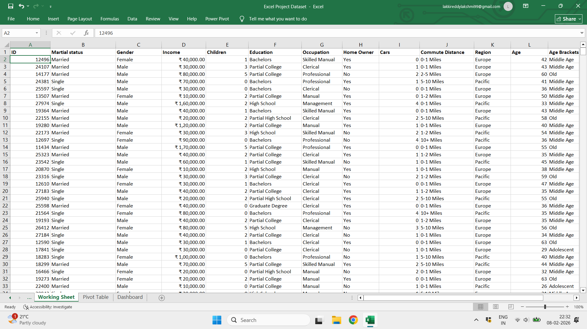
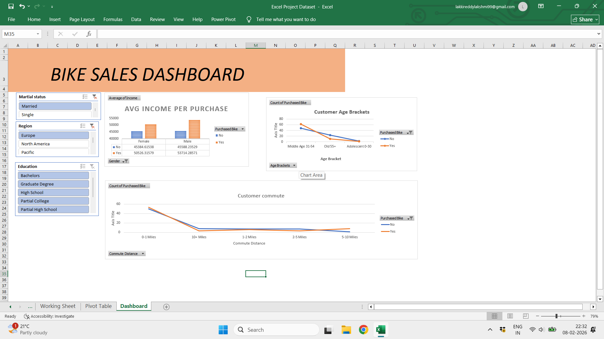
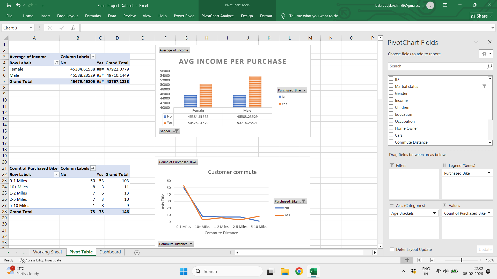

# Two Wheeler Purchase Analysis

## Project Overview
This project analyzes the purchase patterns of two wheeler buyers using Excel. 
It includes data cleaning, formula applications, Pivot Tables, and a Dashboard to visualize insights.

## Data
- Columns: ID, Marital Status, Gender, Income, Children, Education, Occupation, Home Owner, Cars, Commute Distance, Region, Age, Age Bracket, Purchased Two Wheeler
- Data is cleaned using Excel formulas: TRIM, PROPER, IFS

## Key Analysis
- Gender distribution of buyers
- Age group analysis
- Income bracket trends
- Purchased Two Wheeler status
- Home ownership and commute distance insights

## Dashboard
- Contains 3–4 key charts summarizing the data
- Designed to quickly interpret trends and insights

## Tools Used
- Microsoft Excel (Formulas, Pivot Tables, Dashboard)

 ## Worksheet
- 
- 
## Dashboard
Here is the Dashboard showing the two wheeler purchase trends:

## Pivot Table Analysis
The Pivot Table summarizes key insights:

